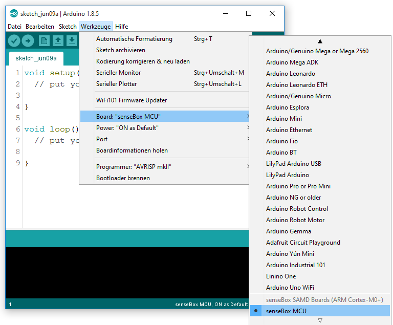
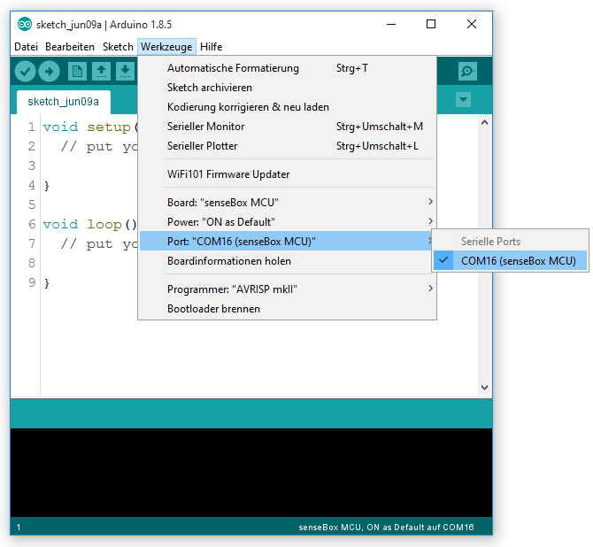
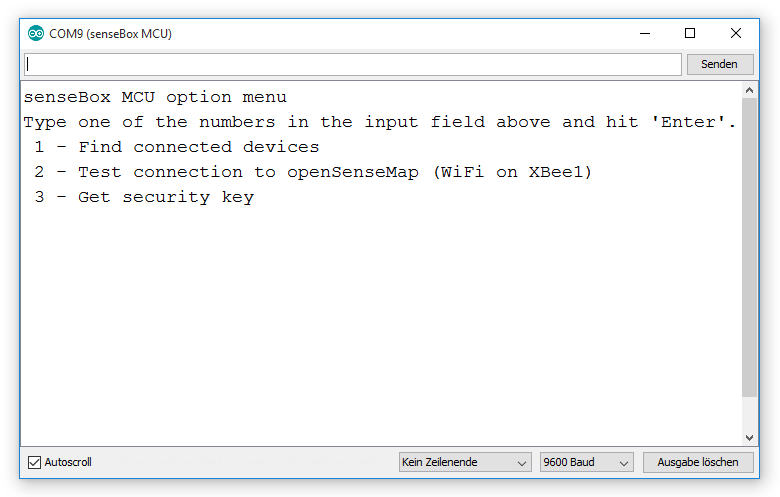
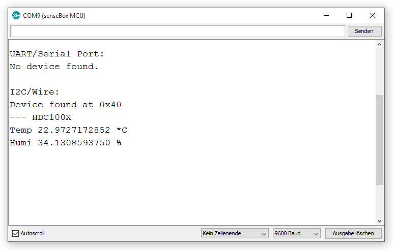

# Schritt 5: Programmierung der Hardware {#head}
<div class="description"> In diesem Kapitel wird beschrieben wie die Programmierung der senseBox funktioniert und wie ihr die mitgelieferten Sensoren und Komponenten testen könnt.</div>

<div class="box_info">
    <i class="fa fa-info fa-fw" aria-hidden="true" style="color: #42acf3;"></i>
  Ein Softwareprogramm für die senseBox wird im Folgenden auch Sketch genannt.
</div>

<div><br><br></div>

## Programmieren mit der Arduino IDE
Mit der Arduino IDE lässt sich ein Sketch kompilieren und auf die senseBox MCU hochladen. Schließt nun die senseBox per USB Kabel an euren Computer an und befolgt die nächsten Schritte.

### Konfiguration in der Arduino IDE
Bevor die senseBox programmieren könnt müsst ihr ein paar Einstellungen in der Arduino IDE vornehmen. Unter dem Reiter `Werkzeuge` müsst ihr bei der Option `Boards` die senseBox MCU unten in der Liste auswählen.



Als nächstes wählt ihr unter `Werkzeuge` -> `Port` die Anschlussnummer des USB Ports aus, an dem die senseBox MCU mit dem Computer verbunden ist. 



<div class="box_warning">
    <i class="fa fa-exclamation-circle fa-fw" aria-hidden="true" style="color: #f0ad4e"></i>
    Der Port lässt sich nur dann auswählen, wenn die senseBox mit dem USB Kabel an den Computer angeschlossen wurde.
</div>

### Hello World Beispiel
Kopiert das Beispiel unterhalb in eure Arduino Umgebung und klickt auf das Pfeilsymbol in der Werkzeugleiste. Im unteren Teil der Arduino Oberfläche bekommt ihr Feedback zum Uploadvorgang. Wenn alles geklappt hat erscheint dort die Meldung `Hochladen abgeschlossen`.

```cpp
int ledPin = LED_BUILTIN; 

void setup()
{
  pinMode(ledPin, OUTPUT);
}

void loop()
{
  digitalWrite(ledPin, HIGH); // turn the LED on (HIGH is the voltage level)
  delay(1000);                // wait for a second
  digitalWrite(ledPin, LOW);  // turn the LED off by making the voltage LOW
  delay(1000);                // wait for a second
}
```

Bei dem Text der hinter dem `//` steht handelt es sich um einen Kommentar der nicht vom Kompiler mit ausgewertet wird. Das hat den Sinn dass man sich besser im Code zurecht findet und man macht es so anderen Programmierern leichter den eigenen Code zu verstehen. 

<div class="box_info">
    <i class="fa fa-info fa-fw" aria-hidden="true" style="color: #42acf3;"></i>
  Anders als bei einem Laptop oder Smartphone läuft auf eurer senseBox kein Betriebssystem wie Windows, Linux oder MacOS. Die senseBox MCU ist ein Mikrocontroller auf dem immer nur das letzte Programm ausgeführt wird, das hochgeladen wurde.
</div>

## Sensoren und Internetverbindung testen
<div class="description">Bevor ihr eure senseBox mit der openSenseMap verbindet sollten alle Sensoren und das Netzwerkmodul überprüft werden um späteren Fehlern vorzubeugen. Mit unserem Testprogramm können nach dem Aufbau der Station der Messvorgang und die Netzwerkverbindung getestet werden.</div>

<div class="box_warning">
    <i class="fa fa-exclamation-circle fa-fw" aria-hidden="true" style="color: #f0ad4e"></i>
    Voraussetzung dafür ist die vorherige Installation der Softwarebibliotheken aus Schritt 3.
</div>

------
### Test-Sketch öffnen
Öffnet aus den Beispielen die Datei `mcu_component_test` (`Datei` -> `Beispiele` -> `senseBoxMCU`). Nachdem ihr diesen Sketch auf die MCU hochgeladen habt, startet ihr den seriellen Monitor indem ihr auf das Lupen-Symbol rechts oben in der Werkzeugleiste klickt. 

<div class="box_info">
    <i class="fa fa-info fa-fw" aria-hidden="true" style="color: #42acf3;"></i>
  Für den Fall dass sich der Monitor nicht öffnet solltet ihr überprüfen ob sich das Board im Programmmodus befindet (einmal auf Reset drücken) und ob der richtige Port ausgewählt wurde. Danach versucht es erneut mit einem Klick auf die Lupe.
</div>

------
### Optionsmenü
Nachdem ihr den seriellen Monitor geöffnet habt erscheint ein Menü auf dessen Funktionen ihr über das Eingabefeld zugreifen könnt:



Dazu schreibt ihr die Nummer der entsprechenden Option in das Eingabefeld und klickt auf „Senden“. Unterhalb findet ihr eine Auflistung der Optionen mit kurzen Beschreibungen.

1. **Find connected sensors**

  Hier könnt ihr überprüfen ob alle angeschlossenen Sensoren richtig initialisiert und erkannt wurden. Für jeden angeschlossenen Sensor sollte es eine Rückmeldung und eine Testmessung geben. Im Beispiel unterhalb wurde ein HDC1080 Temperatur- und Luftfeuchtesensor an einen `I2C/Wire` Port angeschlossen.

  

  <div class="box_info">
      <i class="fa fa-info fa-fw" aria-hidden="true" style="color: #42acf3;"></i>
     Falls bei der Ausgabe einer der angeschlossenen Sensoren fehlt solltet ihr die Kabelverbindung überprüfen und den Test wiederholen.
  </div>

2. **Test connection to openSenseMap**

  Mit dieser Option wird die Internetverbindung getestet. Bei einem erfolgreichen Verbindungsaufbau sollte eine Antwort mit HTTP-Status 200 vom Server ausgegeben werden:

  

  <div class="box_info">
      <i class="fa fa-info fa-fw" aria-hidden="true" style="color: #42acf3;"></i>
     Falls ihr ein WiFi-Modul nutzt, wird außerdem überprüft ob die aktuellste Version der Firmware auf dem Modul installiert ist. Falls die Version veraltet ist solltet ihr sie aktualisieren.
  </div>

3. **Get security key**

  Jedes senseBox Board besitzt einen eigenen, einzigartigen Sicherheitsschlüssel den ihr mit dieser Option auslesen könnt. Er wird genutzt um die Verbindung zwischen der openSenseMap und eurer senseBox zu verschlüsseln damit niemand eure Messungen von außen Manipulieren kann.
  <div class="box_info">
      <i class="fa fa-info fa-fw" aria-hidden="true" style="color: #42acf3;"></i>
     Ihr benötigt diesen Schlüssel im nächsten Schritt bei der Registrierung eurer senseBox auf der openSenseMap.
  </div>

------


