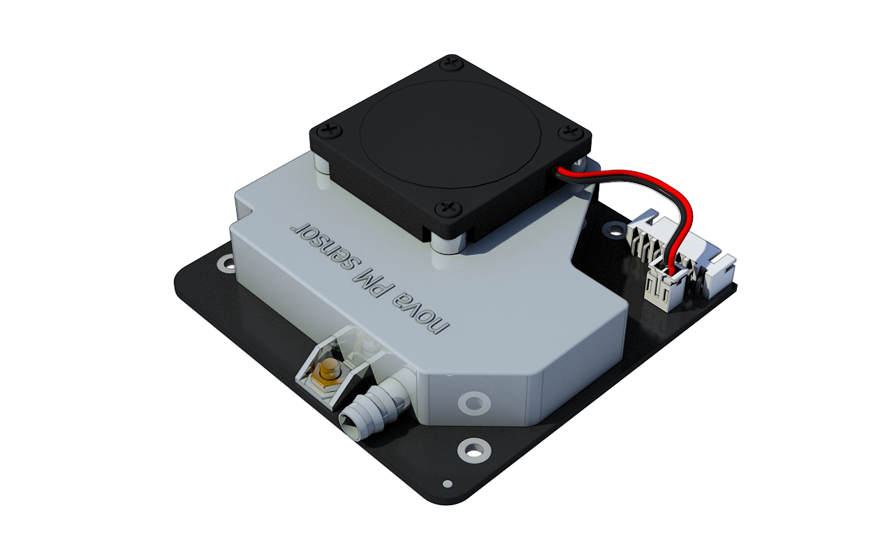
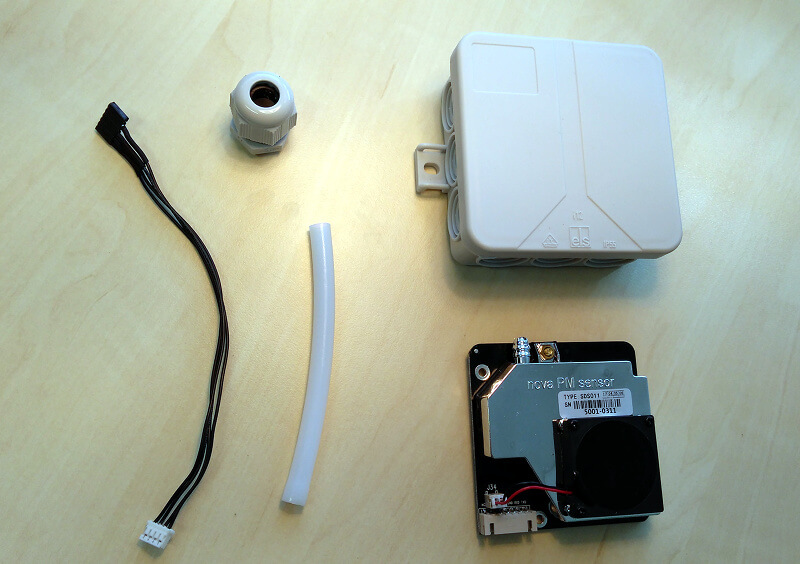

#Feinstaubsensor {#head}
<div class="description">

Mit diesem Sensor SDS011 ist es möglich die Feinstaubkonzentration in der Luft zu bestimmen. Der Sensor gibt zwei Werte aus: Die Konzentration von PM2.5 (Partikel < 2.5 um) und PM10 (Partikel < 10 um). Dieser Sensor ist mit einem kleinen Ventilator ausgestattet, um Luft anzusaugen. In seinem Inneren befindet sich ein Laser, der zusammen mit einer Photodiode die Anzahl der Partikel misst. Die Ergebnisse der Messungen werden in µg/m³ (Mikrogramm pro Kubikmeter) angegeben.
</div>

<div class="line">
    <br>
    <br>
</div>



## Technische Details
* Schnelle Reaktionszeit von weniger als 10 Sekunden
* "Plug-in-and-Go" senseBox kompatibel
* Hohe Auflösung bis zu 0.3µg/m3
* Mehrfach wissenschaftliche Prüfung der Datengenauigkeit

## Zum Aufbau benötigte Bauteile 


   * SDS011 Feinstaub Sensor
   * Verbindungskabel
   * Stück Teflonschlauch Ø = 6mm innen und Ø = 8mm außen
   * Gehäuse
   * Kabelverschraubung 16mm

## Anschluss und Programmierung

Mit dem mitgelieferten Verbindungskabel kannst du deinen Feinstaub Sensor mit dem "UART/Serial"-Port der senseBoxMCU verbinden. 
Ist dies erledigt können wir nun im Programmcode den Sensor initialisieren und uns die ersten Messwerte ausgeben lassen.

<div class="box_warning">
    <i class="fa fa-info fa-fw" aria-hidden="true" style="color: #42acf3;"></i>
    Stelle sicher, dass du das aktuellste Board-Support-Package installiert hast, da du die korrekten Software-Bibliotheken benötigst. Wie das geht wurde dir in <a href ="../erste-schritte/board-support-packages-installieren.md">Schritt 2</a> erklärt!
</div>

Als erstes muss eine Instanz des Sensors erstellt werden. Dazu erstellen wir noch 2 Variablen in denen wir unsere beiden Messwerte
für PM10 und PM2.5 speichern

```arduino 
SDS011 my_sds(Serial1) // Serial1 gibt hier den Seriellen Port an, an dem du den Sensor angeschlossen hast
float p10,p25
```

In der `setup()`-Funktion soll der Sensor nun gestartet werden: 

```arduino
void setup(){
    // Normalen seriellen Port initialisieren 
    Serial.begin(9600);
    while(!Serial);
    // Seriellen Port an dem unsere Sensor angeschlossen ist initialisieren
    Serial1.begin(9600);
    delay(5000)

}
```




In der `loop()`-Funktion können wir mit dem Befehl 'getPm10()' und 'getPm25() die aktuell gemessenen Feinstaubwerte abrufen:

```arduino
void loop(){
    // Variablen den gemessenen Feinstaubwerte zuweisen
    p10 = my_sds.getPm10();
    p25 = my_sds.getPm25();
    //Werte in der Konsole drucken
    Serial.println("P2.5: "+String(p25));
    Serial.println("P10:  "+String(p10));
    delay(1000);
}
```


